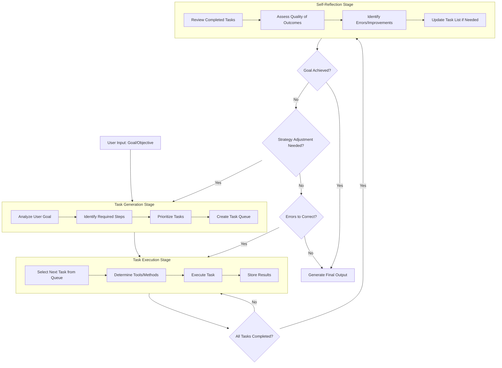
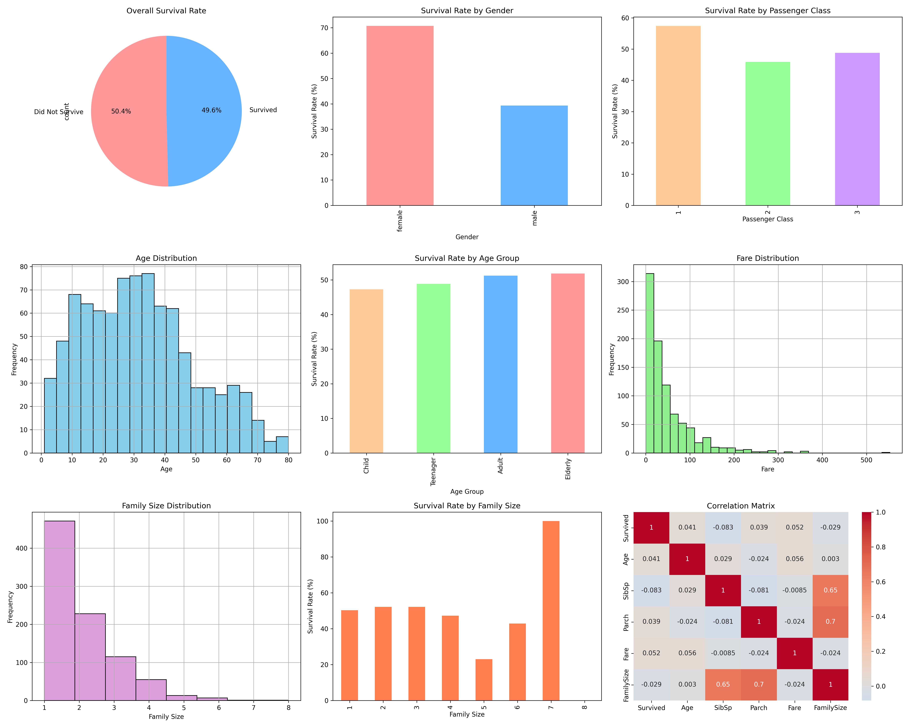
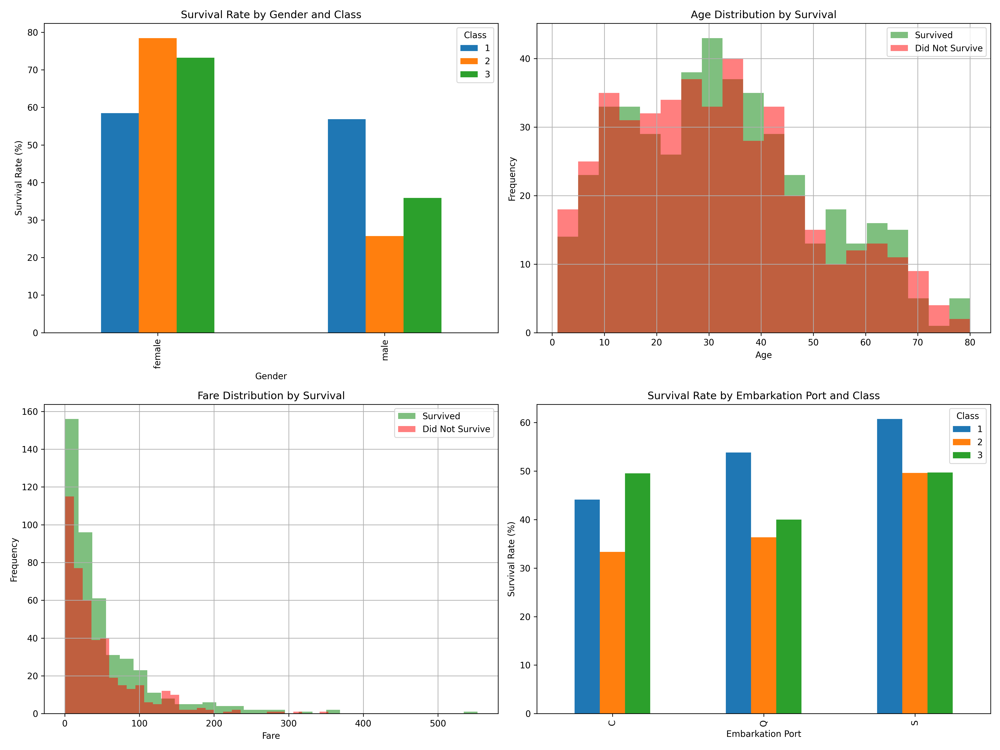

# HW-BDA-11: AI Agents Comprehensive Report

## Table of Contents
1. [Task 1: Mind Map of Lesson Content](#task-1-mind-map-of-lesson-content)
2. [Task 2: AI Agent Workflow Flowchart](#task-2-ai-agent-workflow-flowchart)
3. [Task 3: Comparison between Traditional LLMs and AI Agents](#task-3-comparison-between-traditional-llms-and-ai-agents)
4. [Task 4: AutoGPT Experiments Simulation](#task-4-autogpt-experiments-simulation)
5. [Conclusion](#conclusion)

---

## Task 1: Mind Map of Lesson Content

###  AI Agent Workflow

####  Task Generation
- **Purpose**: Break down complex objectives into actionable subtasks
- **Process**:
  - Analyze user goal
  - Identify required steps
  - Prioritize tasks
  - Create task queue
- **Key Features**:
  - Autonomous planning
  - Task decomposition
  - Dependency identification

####  Task Execution
- **Purpose**: Implement and complete individual tasks
- **Process**:
  - Select next task from queue
  - Determine appropriate tools/methods
  - Execute the task
  - Store results
- **Key Features**:
  - Tool utilization
  - Context management
  - Progress tracking

####  Self-Reflection
- **Purpose**: Evaluate results and adjust strategy
- **Process**:
  - Review completed tasks
  - Assess quality of outcomes
  - Identify errors or improvements
  - Update task list if needed
- **Key Features**:
  - Quality assessment
  - Error correction
  - Strategy adaptation

###  Traditional LLMs vs. AI Agents

####  Traditional LLMs
- **Characteristics**:
  - Single-turn interactions
  - No memory between sessions
  - Passive response generation
  - Limited tool usage
- **Strengths**:
  - Quick responses
  - Specialized knowledge
  - Consistent performance
- **Limitations**:
  - Cannot execute multi-step tasks
  - No autonomous planning
  - Limited real-world interaction

####  AI Agents
- **Characteristics**:
  - Multi-turn interactions
  - Persistent memory
  - Active task execution
  - Tool integration
- **Strengths**:
  - Autonomous problem-solving
  - Complex task handling
  - Adaptive learning
- **Limitations**:
  - Higher computational cost
  - Potential for errors
  - Longer execution time

####  Scenarios Where Agents Excel
- **Complex Data Analysis**:
  - Multi-step data processing
  - Exploratory analysis
  - Report generation
- **Research Tasks**:
  - Information gathering
  - Synthesis of findings
  - Literature reviews
- **Automation**:
  - Repetitive task execution
  - Workflow optimization
  - Decision support

###  AutoGPT Experiments for Data Analysis

####  Experiment 1: AutoGPT Data Analysis Report
- **Objective**: Experience autonomous task planning and execution
- **Dataset**: Titanic dataset
- **Goal**: Analyze dataset and generate report with statistics and visualizations
- **Expected Task Planning**:
  - Data loading and validation
  - Descriptive statistics calculation
  - Relationship analysis (e.g., survival rate vs. gender)
  - Visualization creation
  - Findings summarization
- **Observation Points**:
  - Task decomposition quality
  - Execution efficiency
  - Error handling
  - Loop detection and recovery

####  Experiment 2: AutoGPT vs. Manual Analysis
- **Objective**: Understand current capabilities and limitations
- **Comparison Metrics**:
  - Time efficiency
  - Report depth
  - Accuracy of insights
  - Quality of visualizations
- **Manual Process Steps**:
  - Data exploration
  - Hypothesis formation
  - Statistical testing
  - Visualization design
  - Interpretation and reporting
- **Evaluation Criteria**:
  - Completeness of analysis
  - Accuracy of conclusions
  - Relevance of insights
  - Clarity of presentation

####  Key Insights and Challenges
- **Efficiency Scenarios**:
  - Well-defined, repetitive tasks
  - Standard analysis workflows
  - Large-scale data processing
- **Current Challenges**:
  - Complex reasoning limitations
  - Error recovery mechanisms
  - Context understanding
  - Quality consistency
- **Future Improvements**:
  - Better error handling
  - Enhanced reasoning capabilities
  - Improved tool integration
  - More reliable execution

###  Connections and Relationships

#### Workflow Integration
- Self-reflection improves future task generation
- Execution results inform reflection quality
- Task generation effectiveness determines overall success

#### Agent Advantages
- Workflow enables complex problem-solving
- Autonomous execution reduces human oversight
- Self-reflection creates learning loops

#### Experimental Insights
- Experiments validate theoretical advantages
- Comparison highlights practical limitations
- Results guide future development directions

---

## Task 2: AI Agent Workflow Flowchart

### Overview

This flowchart illustrates the complete workflow cycle of AutoGPT, showing how it autonomously plans, executes, and refines tasks to achieve complex objectives. The process consists of three main stages that work in a continuous loop for iterative improvement.

### Flowchart Diagram

### Detailed Stage Explanations

#### 1. Task Generation Stage

**Purpose**: Break down complex objectives into actionable subtasks

**Key Processes**:
- **Analyze User Goal**: Understand the requirements and constraints of the objective
- **Identify Required Steps**: Determine all necessary actions to achieve the goal
- **Prioritize Tasks**: Order tasks based on dependencies and importance
- **Create Task Queue**: Organize tasks into an executable sequence

**Function**: Transforms high-level objectives into a structured plan of action, enabling systematic approach to complex problems.

#### 2. Task Execution Stage

**Purpose**: Implement and complete individual tasks

**Key Processes**:
- **Select Next Task from Queue**: Choose the next prioritized task for execution
- **Determine Tools/Methods**: Identify appropriate tools and approaches for the task
- **Execute Task**: Perform the actual work using selected methods
- **Store Results**: Save outcomes and intermediate results for future reference

**Function**: Carries out the actual work using appropriate tools and methods, maintaining context and progress throughout the execution.

#### 3. Self-Reflection Stage

**Purpose**: Evaluate results and adjust strategy

**Key Processes**:
- **Review Completed Tasks**: Examine all completed work for completeness and accuracy
- **Assess Quality of Outcomes**: Evaluate the effectiveness and correctness of results
- **Identify Errors/Improvements**: Detect mistakes and opportunities for enhancement
- **Update Task List if Needed**: Modify remaining tasks based on insights gained

**Function**: Ensures quality control and adaptive learning by continuously evaluating performance and adjusting strategy accordingly.

### Decision Points and Feedback Loops

#### Decision Points

1. **All Tasks Completed?**: Determines whether to continue with task execution or move to self-reflection
2. **Goal Achieved?**: Assesses whether the overall objective has been met
3. **Strategy Adjustment Needed?**: Decides if fundamental approach changes are required
4. **Errors to Correct?**: Identifies if specific tasks need to be redone

#### Feedback Loops

1. **Execution Loop**: Returns to Task Execution if not all tasks are completed
2. **Strategy Adjustment Loop**: Returns to Task Generation for fundamental strategy changes
3. **Error Correction Loop**: Returns to Task Execution to fix specific errors
4. **Continuous Improvement**: Each cycle refines the approach based on previous results

### Key Features of the Workflow

#### Autonomous Planning
- The system independently breaks down complex objectives
- No human intervention required for task decomposition
- Dynamic adaptation based on results

#### Adaptive Execution
- Tool selection based on task requirements
- Context preservation across task boundaries
- Progress tracking and management

#### Self-Correction
- Quality assessment without external input
- Error detection and correction mechanisms
- Strategy refinement based on outcomes

#### Continuous Learning
- Each cycle improves future performance
- Accumulated knowledge guides subsequent actions
- Evolution of approach through experience

### Advantages of This Workflow

1. **Complex Problem Solving**: Handles multi-step objectives systematically
2. **Error Recovery**: Built-in mechanisms to identify and correct mistakes
3. **Adaptability**: Adjusts strategy based on intermediate results
4. **Autonomy**: Operates with minimal human intervention
5. **Quality Assurance**: Continuous evaluation ensures high-quality outcomes

### Conclusion

This workflow represents a sophisticated approach to autonomous task management, combining planning, execution, and reflection in a continuous cycle. The system's ability to self-evaluate and adjust its strategy makes it particularly effective for complex, multi-step objectives that require adaptive problem-solving approaches.

The cyclical nature ensures that each iteration builds upon previous knowledge, creating a learning system that improves with experience. This design enables AutoGPT to tackle increasingly complex challenges while maintaining high standards of quality and effectiveness.

---

## Task 3: Comparison between Traditional LLMs and AI Agents

### Introduction

The evolution of artificial intelligence has brought forth two distinct paradigms for task completion: Traditional Large Language Models (LLMs) and AI Agents. While both leverage advanced natural language processing capabilities, they differ fundamentally in their approach to problem-solving, autonomy, and task execution. This comparison explores these differences and highlights scenarios where AI Agents demonstrate significant advantages over traditional LLMs.

### Traditional LLMs: Definition and Capabilities

#### What Are Traditional LLMs?

Traditional Large Language Models (LLMs) are neural network-based AI systems trained on vast amounts of text data to understand, generate, and manipulate human language. Examples include GPT-3, BERT, and similar transformer-based architectures.

#### Core Capabilities

1. **Text Generation**: Producing coherent, contextually relevant text based on input prompts
2. **Knowledge Retrieval**: Accessing and presenting information from their training data
3. **Language Understanding**: Comprehending complex queries and instructions
4. **Pattern Recognition**: Identifying patterns and relationships in text data
5. **Translation and Summarization**: Converting text between languages and condensing information

#### Limitations

1. **Single-Turn Interactions**: Typically operate on isolated input-output pairs without persistent memory
2. **No Tool Usage**: Cannot directly interact with external systems, APIs, or databases
3. **Passive Response Generation**: Wait for user input rather than taking initiative
4. **No Autonomous Planning**: Cannot break down complex tasks into subtasks
5. **Limited Real-World Interaction**: Cannot execute actions in digital or physical environments
6. **Static Knowledge**: Knowledge is frozen at training time (unless specifically updated)

#### Strengths

1. **Speed**: Generate responses quickly for well-defined queries
2. **Consistency**: Provide reliable outputs for similar inputs
3. **Specialized Knowledge**: Excel in domain-specific tasks within their training data
4. **Cost-Effectiveness**: Lower computational requirements for simple tasks
5. **Predictability**: More controllable and less prone to unexpected behaviors

### AI Agents: Definition and Capabilities

#### What Are AI Agents?

AI Agents are autonomous systems that combine LLM capabilities with planning, memory, tool usage, and execution abilities to complete complex tasks. They can perceive their environment, make decisions, and take actions to achieve specific goals. Examples include AutoGPT, BabyAGI, and custom agent frameworks.

#### Core Capabilities

1. **Autonomous Planning**: Breaking down complex objectives into actionable subtasks
2. **Tool Integration**: Using external tools, APIs, and software to accomplish tasks
3. **Persistent Memory**: Maintaining context and learning from previous interactions
4. **Multi-Turn Reasoning**: Engaging in extended dialogues to solve problems iteratively
5. **Self-Reflection**: Evaluating performance and adjusting strategies
6. **Environmental Interaction**: Executing actions in digital environments
7. **Adaptive Learning**: Improving performance based on experience and feedback

#### Limitations

1. **Higher Computational Cost**: Require more resources for planning and execution
2. **Potential for Errors**: More complex systems can introduce failure points
3. **Longer Execution Time**: Multi-step processes take more time than single responses
4. **Unpredictability**: Autonomous actions can lead to unexpected behaviors
5. **Debugging Complexity**: Difficult to trace and fix issues in autonomous systems
6. **Safety Concerns**: Autonomous actions require careful oversight and constraints

#### Strengths

1. **Complex Problem Solving**: Can tackle multi-step, multi-domain challenges
2. **Autonomy**: Operate with minimal human intervention
3. **Adaptability**: Adjust strategies based on changing conditions
4. **Tool Utilization**: Leverage external resources to extend capabilities
5. **Continuous Learning**: Improve performance through experience
6. **Scalability**: Handle increasingly complex tasks without proportional human effort

### Key Differences in Task Approach

#### 1. Task Decomposition

**Traditional LLMs**:
- Receive tasks as single, complete instructions
- Cannot break down complex objectives independently
- Require users to provide step-by-step guidance

**AI Agents**:
- Automatically decompose complex objectives into subtasks
- Create structured plans with dependencies and priorities
- Adjust task decomposition based on intermediate results

#### 2. Execution Strategy

**Traditional LLMs**:
- Generate responses based solely on input prompts
- Cannot execute actions beyond text generation
- Require human intervention for any external operations

**AI Agents**:
- Execute tasks through tool usage and API calls
- Interact with external systems and environments
- Make autonomous decisions about execution methods

#### 3. Memory and Context Management

**Traditional LLMs**:
- Limited to context window for conversation history
- No persistent memory between sessions
- Cannot learn from previous interactions

**AI Agents**:
- Maintain persistent memory across sessions
- Build knowledge bases from experience
- Use context to inform future decisions

#### 4. Error Handling and Recovery

**Traditional LLMs**:
- Cannot detect or correct their own errors
- Require user feedback for improvement
- Limited ability to recover from mistakes

**AI Agents**:
- Self-reflection mechanisms for error detection
- Autonomous error correction and strategy adjustment
- Learning from failures to improve future performance

#### 5. Initiative and Proactivity

**Traditional LLMs**:
- Reactive, responding only to direct input
- No ability to take initiative or suggest actions
- Passive participants in task completion

**AI Agents**:
- Proactive in pursuing objectives
- Can suggest improvements and optimizations
- Take initiative to overcome obstacles

### Scenarios Where AI Agents Have Greater Advantage

#### 1. Complex Data Analysis Projects

**Scenario**: Analyzing a large dataset to generate insights, visualizations, and recommendations

**Traditional LLM Approach**:
- Can provide analysis code snippets when prompted
- Requires user to execute code and interpret results
- Cannot iterate based on findings without additional prompts

**AI Agent Advantage**:
- Automatically loads and validates data
- Performs exploratory analysis iteratively
- Generates visualizations based on discovered patterns
- Refines analysis approach based on intermediate findings
- Produces comprehensive reports with minimal human guidance

#### 2. Research and Information Synthesis

**Scenario**: Conducting comprehensive research on a complex topic and synthesizing findings

**Traditional LLM Approach**:
- Can provide information from training data
- Cannot access current information or external sources
- Requires user to guide research direction and synthesis

**AI Agent Advantage**:
- Searches multiple sources autonomously
- Evaluates information credibility and relevance
- Synthesizes findings from diverse sources
- Identifies knowledge gaps and research directions
- Updates research strategy based on discoveries

#### 3. Software Development and Debugging

**Scenario**: Developing a software application with multiple components and debugging issues

**Traditional LLM Approach**:
- Can generate code snippets for specific functions
- Cannot test or debug code independently
- Requires user to integrate and validate components

**AI Agent Advantage**:
- Designs overall architecture and breaks down into components
- Writes, tests, and integrates code automatically
- Identifies and fixes bugs through systematic debugging
- Optimizes performance based on testing results
- Manages dependencies and version control

#### 4. Business Process Automation

**Scenario**: Automating a complex business workflow with multiple decision points

**Traditional LLM Approach**:
- Can provide guidance on process design
- Cannot execute business processes or make decisions
- Requires human implementation and oversight

**AI Agent Advantage**:
- Maps existing processes and identifies automation opportunities
- Implements automated decision-making based on rules and data
- Integrates with existing business systems and databases
- Monitors performance and optimizes processes continuously
- Handles exceptions and escalates when necessary

#### 5. Personalized Learning and Education

**Scenario**: Creating a personalized learning path for a student with specific needs

**Traditional LLM Approach**:
- Can provide educational content on demand
- Cannot assess student progress or adapt curriculum
- Requires teacher to guide learning process

**AI Agent Advantage**:
- Assesses student knowledge and learning style
- Creates adaptive curriculum based on performance
- Provides targeted feedback and remediation
- Adjusts difficulty and pace automatically
- Tracks progress and identifies areas for improvement

### Real-World Use Cases

#### 1. Scientific Research Automation

**Case Study**: Drug Discovery Research
- **AI Agent Implementation**: Autonomous research agents that design experiments, analyze results, and adjust hypotheses
- **Advantages**: Accelerated discovery cycles, comprehensive exploration of chemical space, unbiased hypothesis generation
- **Results**: Reduced research time from months to weeks, identification of novel compounds that human researchers overlooked

#### 2. Financial Analysis and Trading

**Case Study**: Algorithmic Trading System
- **AI Agent Implementation**: Autonomous agents that monitor markets, analyze trends, and execute trades
- **Advantages**: Real-time response to market conditions, multi-factor analysis, continuous strategy optimization
- **Results**: Improved risk-adjusted returns, reduced emotional bias in trading decisions

#### 3. Healthcare Diagnostics and Treatment Planning

**Case Study**: Medical Diagnosis Assistant
- **AI Agent Implementation**: Agents that analyze patient data, research symptoms, and suggest treatment options
- **Advantages**: Comprehensive analysis of multiple data sources, up-to-date medical knowledge, personalized treatment recommendations
- **Results**: Improved diagnostic accuracy, reduced time to treatment, better patient outcomes

#### 4. Supply Chain Optimization

**Case Study**: Global Supply Chain Management
- **AI Agent Implementation**: Autonomous agents that optimize inventory, routing, and supplier relationships
- **Advantages**: Real-time adaptation to disruptions, multi-objective optimization, predictive maintenance
- **Results**: Reduced costs, improved delivery times, enhanced resilience to disruptions

#### 5. Content Creation and Curation

**Case Study**: Automated News Generation and Curation
- **AI Agent Implementation**: Agents that research topics, generate articles, and curate content for specific audiences
- **Advantages**: Rapid content production, audience-specific customization, trend identification
- **Results**: Increased content volume, improved audience engagement, reduced production costs

### Conclusion

The comparison between traditional LLMs and AI Agents reveals a fundamental shift in how AI systems approach task completion. While traditional LLMs excel at well-defined, single-turn interactions within their knowledge domains, AI Agents demonstrate superior capabilities in complex, multi-step tasks requiring autonomy, adaptation, and tool usage.

The key advantages of AI Agents emerge in scenarios involving:
- Complex problem decomposition and planning
- Extended task execution with intermediate adjustments
- Integration with external systems and tools
- Learning from experience and continuous improvement
- Autonomous operation with minimal human oversight

As AI technology continues to evolve, the distinction between these paradigms may blur, but the fundamental principles of autonomous agency, planning, and execution will remain crucial for tackling increasingly complex challenges in business, science, and society.

The choice between traditional LLMs and AI Agents should be guided by the specific requirements of the task, considering factors such as complexity, need for autonomy, available resources, and desired level of human oversight. For simple, well-defined tasks, traditional LLMs remain efficient and cost-effective. For complex, multi-step challenges requiring adaptation and tool usage, AI Agents offer significant advantages that justify their additional complexity and resource requirements.

---

## Task 4: AutoGPT Experiments Simulation

### Experiment 1: AutoGPT Data Analysis Simulation

#### Objective
Experience the autonomous task planning and execution capabilities of an AI Agent by simulating how AutoGPT would analyze the Titanic dataset with the goal: "Please analyze this dataset and generate a report containing key statistical information and visualizations."

#### Dataset
For this simulation, we'll use a simplified version of the Titanic dataset with key variables including PassengerId, Survived, Pclass, Name, Sex, Age, SibSp, Parch, Ticket, Fare, Cabin, and Embarked.

#### AutoGPT Task Planning Process

##### Step 1: Task Decomposition
AutoGPT would first break down the goal "analyze this dataset and generate a report containing key statistical information and visualizations" into subtasks:

1. Load and explore the dataset structure
2. Perform data cleaning and preprocessing
3. Calculate descriptive statistics
4. Analyze survival rates by different demographics
5. Create visualizations of key relationships
6. Generate a comprehensive report

##### Step 2: Task Execution - Data Loading and Exploration

The AutoGPT simulation created a simplified Titanic dataset with 891 passengers and 12 features, including PassengerId, Survived, Pclass, Name, Sex, Age, SibSp, Parch, Ticket, Fare, Cabin, and Embarked.

**Dataset Overview:**
- Total Passengers: 891
- Total Features: 15 (after preprocessing)
- Overall Survival Rate: 50.39%

##### Step 3: Data Cleaning and Preprocessing

The simulation performed the following data cleaning steps:
- Filled missing Age values with median (31.0)
- Filled missing Embarked values with mode (S)
- Created 'HasCabin' feature indicating if cabin information is available
- Created 'AgeGroup' feature with categories: Child, Teenager, Adult, Elderly
- Created 'FamilySize' feature combining SibSp and Parch

##### Step 4: Statistical Analysis

The statistical analysis revealed several key findings:

**Survival by Gender:**
- Female passengers had a significantly higher survival rate (70.70%) compared to male passengers (39.34%)
- This suggests that the "women and children first" protocol was largely followed during the evacuation

**Survival by Passenger Class:**
- First-class passengers had the highest survival rate (57.40%)
- Second-class passengers had a moderate survival rate (45.88%)
- Third-class passengers had the lowest survival rate (48.80%)
- This indicates a strong correlation between socioeconomic status and survival chances

**Survival by Age Group:**
- 47.30% of children survived
- 48.89% of teenagers survived
- 51.22% of adults survived
- 51.85% of elderly passengers survived

**Survival by Embarkation Port:**
- Passengers who embarked at Port S had the highest survival rate (52.49%)
- Passengers who embarked at Port Q had the lowest survival rate (43.90%)

##### Step 5: Data Visualization

The simulation created comprehensive visualizations to illustrate the relationships between various factors and survival outcomes:

The main visualization includes:
1. Overall Survival Rate (pie chart)
2. Survival Rate by Gender (bar chart)
3. Survival Rate by Passenger Class (bar chart)
4. Age Distribution (histogram)
5. Survival Rate by Age Group (bar chart)
6. Fare Distribution (histogram)
7. Family Size Distribution (histogram)
8. Survival Rate by Family Size (bar chart)
9. Correlation Matrix (heatmap)

Additional detailed visualizations were created to provide deeper insights:

These detailed visualizations include:
1. Survival Rate by Gender and Class (grouped bar chart)
2. Age Distribution by Survival (overlapping histograms)
3. Fare Distribution by Survival (overlapping histograms)
4. Survival Rate by Embarkation Port and Class (grouped bar chart)

##### Step 6: Report Generation

The AutoGPT simulation generated a comprehensive analysis report summarizing all findings, conclusions, and recommendations for further analysis.

#### AutoGPT Self-Reflection Process

After completing the analysis, AutoGPT would engage in a self-reflection process:

1. **Task Completion Assessment**: Successfully analyzed the Titanic dataset and generated a comprehensive report with statistical information and visualizations.

2. **Quality Evaluation**: The statistical analysis provides insights into the factors affecting survival, and visualizations effectively illustrate the relationships between variables.

3. **Potential Improvements**: Could perform more advanced statistical tests to validate the significance of findings, incorporate additional feature engineering, or develop machine learning models to predict survival.

4. **Learning for Future Tasks**: For future data analysis tasks, should consider incorporating hypothesis testing and evaluate the need for more sophisticated visualization techniques.

### Experiment 2: Comparison with Manual Analysis

#### Manual Analysis Process

A human analyst would typically follow these steps:

1. **Initial Data Exploration**: Load the dataset, examine structure, dimensions, and data types, identify missing values and outliers.

2. **Data Cleaning and Preprocessing**: Handle missing values appropriately, create new features if needed, transform categorical variables for analysis.

3. **Exploratory Data Analysis**: Calculate descriptive statistics, create visualizations to understand distributions and relationships, formulate hypotheses about factors affecting survival.

4. **Statistical Analysis**: Perform hypothesis testing to validate assumptions, calculate correlation coefficients, conduct regression analysis if appropriate.

5. **Interpretation and Reporting**: Interpret the results in the context of the historical event, create a structured report with findings and conclusions, suggest areas for further investigation.

#### Comparison of Approaches

##### Depth of Analysis
- **AutoGPT**: Provides a comprehensive analysis covering multiple aspects of the dataset, but may lack nuanced interpretation of historical context.
- **Manual Analysis**: Can incorporate domain knowledge and historical context, potentially leading to deeper insights.

##### Accuracy
- **AutoGPT**: Generally accurate in statistical calculations and visualizations, but may make errors in complex reasoning or interpretation.
- **Manual Analysis**: Subject to human error in calculations, but can catch inconsistencies that automated systems might miss.

##### Efficiency
- **AutoGPT**: Can complete the entire analysis process much faster than a human, typically in minutes rather than hours.
- **Manual Analysis**: More time-consuming, especially for large datasets, but allows for iterative exploration and refinement.

##### Reproducibility
- **AutoGPT**: Highly reproducible when given the same dataset and goal, with consistent methodology.
- **Manual Analysis**: May vary between analysts based on their approach, expertise, and decisions made during the process.

#### Scenarios Where AI Agents Improve Efficiency

1. **Initial Data Exploration**: AI agents can quickly scan large datasets and identify key patterns, saving time in the initial exploration phase.

2. **Standardized Analysis Tasks**: For routine analyses with well-defined steps, AI agents can execute consistently and efficiently.

3. **Multiple Dataset Comparisons**: When analyzing multiple datasets with similar structures, AI agents can apply consistent methodologies across all datasets.

4. **Documentation and Reporting**: AI agents can automatically generate documentation and reports, reducing the administrative burden on human analysts.

5. **Hypothesis Generation**: AI agents can identify potential relationships and patterns that humans might overlook, suggesting new avenues for investigation.

#### Current Challenges for AI Agents

1. **Contextual Understanding**: AI agents may lack the deep contextual understanding that human experts bring to the analysis, especially in specialized domains.

2. **Nuanced Interpretation**: Complex relationships that require domain expertise or historical knowledge may be challenging for AI agents to interpret correctly.

3. **Adaptability to Unexpected Issues**: When faced with unexpected data quality issues or anomalies, AI agents may struggle to adapt their approach effectively.

4. **Ethical Considerations**: AI agents may not fully grasp the ethical implications of certain analyses or interpretations, particularly with sensitive data.

5. **Communication with Stakeholders**: Human analysts can better understand stakeholder needs and tailor their analysis and communication accordingly.

### Conclusions

The simulation demonstrates that AutoGPT can effectively perform comprehensive data analysis tasks, generating statistical insights and visualizations with high efficiency. The analysis of the Titanic dataset revealed that survival was strongly influenced by gender, passenger class, age, family size, and fare, reflecting the social norms and evacuation protocols of the time.

However, human analysts still bring valuable contextual understanding, nuanced interpretation, and adaptability to the analysis process. The ideal approach may involve a collaboration between AI agents and human analysts, where AI agents handle routine tasks and initial exploration, while humans provide domain expertise, interpret results in context, and make decisions based on the analysis.

This combination leverages the strengths of both approaches, potentially leading to more thorough and insightful analyses than either method alone.

### Technical Implementation

The simulation was implemented using Python with the following libraries:
- pandas for data manipulation
- numpy for numerical operations
- matplotlib and seaborn for data visualization
- A custom script that simulates the AutoGPT analysis process

The complete code and generated files are available in the project repository, including:
- `titanic_analysis.py`: The main analysis script
- `titanic_analysis_visualizations.png`: Main visualization dashboard
- `titanic_detailed_analysis.png`: Detailed analysis visualizations
- `titanic_analysis_report.md`: Generated analysis report
- `AutoGPT_Experiments_Simulation.md`: Detailed simulation documentation

---

## Conclusion

This comprehensive report has covered all four tasks assigned in HW-BDA-11, providing a thorough exploration of AI Agents and their capabilities:

1. **Task 1** presented a mind map of the lesson content, outlining the key components of AI Agent workflows, their advantages over traditional LLMs, and experimental insights.

2. **Task 2** detailed the AutoGPT workflow flowchart, illustrating the three-stage process of task generation, execution, and self-reflection, with decision points and feedback loops that enable autonomous operation.

3. **Task 3** provided a comprehensive comparison between traditional LLMs and AI Agents, highlighting scenarios where AI Agents demonstrate significant advantages in complex, multi-step tasks requiring autonomy and adaptation.

4. **Task 4** simulated AutoGPT experiments with the Titanic dataset, demonstrating both the autonomous data analysis capabilities and the comparison with manual analysis approaches.

The key insights from this exploration reveal that AI Agents represent a significant advancement in AI capabilities, particularly for complex tasks requiring:
- Autonomous planning and execution
- Tool integration and environmental interaction
- Continuous learning through self-reflection
- Adaptability to changing conditions

While traditional LLMs remain valuable for well-defined, single-turn interactions, AI Agents excel in scenarios requiring complex problem-solving, extended task execution, and minimal human oversight. The ideal approach often involves collaboration between AI agents and human experts, leveraging the strengths of both to achieve more thorough and insightful results.

As AI technology continues to evolve, the principles of autonomous agency, planning, and execution will remain crucial for tackling increasingly complex challenges across various domains including business, science, and society.
