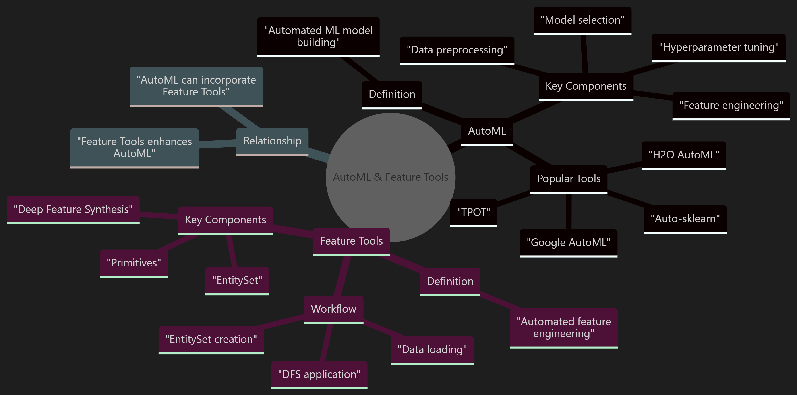
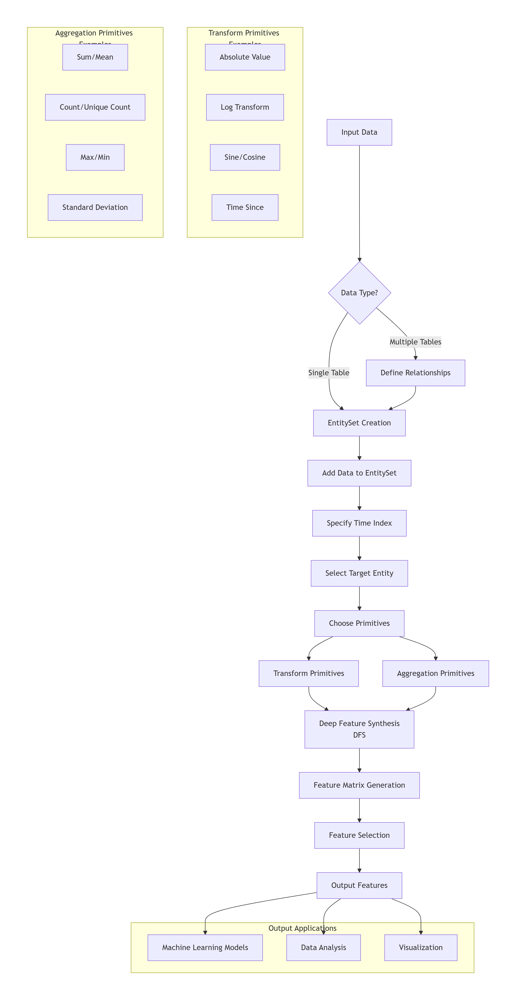

# AutoML and Feature Tools Experiment Report

## Abstract

This report presents a comprehensive analysis of Automated Machine Learning (AutoML) and Feature Engineering Tools in the context of house price prediction. The experiment compares three approaches: manual feature engineering, automated feature engineering using FeatureTools, and end-to-end AutoML using TPOT. The study evaluates the effectiveness of each approach based on standard regression metrics including Root Mean Square Error (RMSE), Mean Absolute Error (MAE), and R-squared (R²) score.

## 1. Introduction to AutoML and Feature Tools

### 1.1 Automated Machine Learning (AutoML)

Automated Machine Learning (AutoML) refers to the process of automating the end-to-end process of applying machine learning to real-world problems. AutoML systems aim to make machine learning accessible to non-experts and improve efficiency for experts by automating tasks such as data preprocessing, feature engineering, model selection, hyperparameter optimization, and model evaluation.

The primary goal of AutoML is to reduce the barrier to entry for machine learning applications while maintaining or improving model performance compared to manually designed solutions. AutoML systems typically handle the entire machine learning pipeline from raw data to deployable models with minimal human intervention.

### 1.2 Feature Engineering Tools

Feature Engineering Tools, particularly FeatureTools, represent a specialized approach to automating one of the most critical and time-consuming aspects of machine learning: feature engineering. FeatureTools is an open-source Python library that uses Deep Feature Synthesis (DFS) to automatically generate features from temporal and relational datasets.

Unlike general AutoML systems that automate the entire pipeline, FeatureTools focuses specifically on creating meaningful features from existing data. It excels at handling complex datasets with multiple related tables and temporal information, automatically generating features that would typically require significant domain expertise and manual effort to create.

## 2. Mindmap of AutoML and Feature Tools

The following mindmap illustrates the key components, relationships, and concepts in Automated Machine Learning (AutoML) and Feature Engineering Tools:

### Key Insights

1. **Complementary Nature**: AutoML and Feature Tools are complementary technologies that can work together.

2. **Different Focus**: AutoML automates the entire ML pipeline, while Feature Tools focuses specifically on feature engineering.

3. **Integration**: Feature Tools can enhance AutoML by providing automated feature engineering capabilities.

## 3. Feature Tools Workflow

Feature Tools is an open-source Python library for automated feature engineering. It uses a technique called Deep Feature Synthesis (DFS) to automatically generate features from temporal and relational datasets.

### Workflow Diagram

### Detailed Workflow Steps

#### 1. Input Data Preparation
- **Single Table**: Direct loading of tabular data
- **Multiple Tables**: Loading related tables with defined relationships
- **Data Types**: Ensuring proper data type recognition (categorical, numerical, temporal)

#### 2. EntitySet Creation
- **EntitySet**: A structure that holds all data and relationships
- **Entities**: Individual tables within the EntitySet
- **Relationships**: Connections between entities (foreign key relationships)

#### 3. Data Configuration
- **Time Index**: Specifying time-based columns for temporal feature creation
- **Variable Types**: Defining categorical, numerical, and other variable types
- **Target Entity**: Selecting the entity for which features will be generated

#### 4. Primitive Selection
- **Transform Primitives**: Functions applied to single variables
  - Examples: absolute, log, sine, cosine, time_since
  - Applied to individual columns to create new features
  
- **Aggregation Primitives**: Functions applied across relationships
  - Examples: sum, mean, count, max, min, standard_deviation
  - Applied to related entities to create aggregated features

#### 5. Deep Feature Synthesis (DFS)
- **Core Algorithm**: The heart of Feature Tools
- **Feature Stacking**: Creating features by applying primitives to existing features
- **Multi-level Generation**: Creating features at different depths of relationships
- **Temporal Features**: Time-based features using the time index

#### 6. Feature Matrix Generation
- **Output Structure**: A matrix where rows are instances and columns are features
- **Feature Naming**: Automatic generation of descriptive feature names
- **Metadata**: Information about how each feature was created

#### 7. Feature Selection (Optional)
- **Relevance Filtering**: Removing irrelevant or redundant features
- **Importance Ranking**: Ranking features by their predictive power
- **Custom Selection**: Manual selection based on domain knowledge

### Deep Feature Synthesis (DFS)

DFS is the algorithm that powers Feature Tools. It works by:
1. Applying transform primitives to base features
2. Applying aggregation primitives across relationships
3. Stacking features to create more complex ones
4. Repeating this process to generate features at different depths

### Example Feature Generation

For a customer transactions dataset:
- **Level 1**: `transaction.amount` (base feature)
- **Level 2**: `SUM(transaction.amount)` (aggregation)
- **Level 3**: `MEAN(SUM(transaction.amount))` (stacked aggregation)

## 4. AutoML Workflow

Automated Machine Learning (AutoML) refers to the process of automating the end-to-end process of applying machine learning to real-world problems. AutoML systems aim to make machine learning accessible to non-experts and improve efficiency for experts.

### Detailed Workflow Steps

#### 1. Data Preprocessing
- **Missing Value Handling**: Imputation or removal of missing data
- **Outlier Detection**: Identification and handling of anomalous values
- **Data Cleaning**: Removing duplicates, correcting errors
- **Data Normalization**: Scaling numerical features to standard ranges

#### 2. Feature Engineering
- **Feature Creation**: Generating new features from existing ones
- **Feature Transformation**: Applying mathematical transformations
- **Feature Scaling**: Normalizing or standardizing features
- **Encoding Categorical Variables**: Converting categorical data to numerical format

#### 3. Feature Selection
- **Filter Methods**: Selecting features based on statistical properties
- **Wrapper Methods**: Using model performance to select features
- **Embedded Methods**: Feature selection as part of model training
- **Dimensionality Reduction**: Techniques like PCA for feature reduction

#### 4. Model Selection
- **Algorithm Selection**: Choosing appropriate ML algorithms
- **Ensemble Methods**: Combining multiple models for better performance
- **Neural Architecture Search**: Optimizing neural network architectures
- **Model Comparison**: Evaluating different models on the same data

#### 5. Hyperparameter Optimization
- **Grid Search**: Exhaustive search over specified parameter values
- **Random Search**: Random sampling of parameter combinations
- **Bayesian Optimization**: Using probabilistic models to guide search
- **Evolutionary Algorithms**: Using genetic algorithms for optimization

#### 6. Model Evaluation
- **Cross-Validation**: Robust evaluation using multiple data splits
- **Performance Metrics**: Measuring accuracy, precision, recall, etc.
- **Model Interpretation**: Understanding model decisions
- **Error Analysis**: Identifying patterns in model mistakes

#### 7. Iteration and Refinement
- **Performance Feedback**: Using evaluation results to guide improvements
- **Pipeline Adjustment**: Modifying preprocessing or feature engineering
- **Algorithm Tuning**: Trying different models or parameters
- **Feature Re-engineering**: Creating or modifying features based on insights

#### 8. Final Model Training
- **Full Dataset Training**: Training on all available data
- **Model Finalization**: Freezing the model architecture and parameters
- **Validation**: Final verification of model performance
- **Documentation**: Recording model specifications and performance

#### 9. Model Deployment
- **Cloud Deployment**: Hosting models on cloud platforms
- **Edge Deployment**: Running models on local devices
- **API Integration**: Exposing model functionality through APIs
- **Batch Processing**: Running predictions on batches of data

#### 10. Monitoring and Maintenance
- **Performance Monitoring**: Tracking model performance over time
- **Data Drift Detection**: Identifying changes in input data distribution
- **Model Retraining**: Updating models with new data
- **Version Control**: Managing different model versions

### Key AutoML Techniques

#### Neural Architecture Search (NAS)
- Automated design of neural network architectures
- Search strategies: reinforcement learning, evolutionary algorithms, gradient-based
- Balances model complexity and performance

#### Meta-Learning
- Learning from previous machine learning tasks
- Transferring knowledge to new problems
- Improves model selection and hyperparameter tuning

#### Transfer Learning
- Leveraging pre-trained models for new tasks
- Reduces training time and data requirements
- Particularly effective for image and text data

## 5. Methodology of the House Price Prediction Experiment

### 5.1 Dataset

The experiment utilizes the California Housing dataset, which contains information about housing prices in California districts. The dataset includes the following features:
- MedInc: Median income in block
- HouseAge: Median house age in block
- AveRooms: Average number of rooms
- AveBedrms: Average number of bedrooms
- Population: Block population
- AveOccup: Average house occupancy
- Latitude: House block latitude
- Longitude: House block longitude
- Price: Median house value (target variable)

### 5.2 Experimental Design

The experiment compares three different approaches to the house price prediction problem:

#### Approach 1: Manual Feature Engineering
- Created domain-specific features based on housing market knowledge
- Features included:
  - Rooms_per_person: Average rooms divided by occupancy
  - Bedrooms_ratio: Average bedrooms divided by total rooms
  - Population_density: Population divided by occupancy and rooms
  - Location_score: Distance-based feature from central California coordinates
  - Age_income_interaction: Product of house age and median income
- Used RandomForestRegressor with standardized features
- Evaluated using 80-20 train-test split

#### Approach 2: FeatureTools Automated Feature Engineering
- Applied Deep Feature Synthesis with maximum depth of 2
- Generated features automatically from the original dataset
- Removed features with missing values
- Used RandomForestRegressor with standardized features
- Evaluated using the same 80-20 train-test split with random_state=42

#### Approach 3: AutoML (TPOT)
- Used TPOT (Tree-based Pipeline Optimization Tool) for AutoML
- Configured with 5 generations and population size of 20
- Allowed TPOT to automatically optimize the entire pipeline
- Evaluated using the same 80-20 train-test split with random_state=42

### 5.3 Evaluation Metrics

The performance of each approach was evaluated using three standard regression metrics:

1. **Root Mean Square Error (RMSE)**: Measures the average magnitude of the errors between predicted and actual values.
   \[
   RMSE = \sqrt{\frac{1}{n}\sum_{i=1}^{n}(y_i - \hat{y}_i)^2}
   \]

2. **Mean Absolute Error (MAE)**: Measures the average absolute difference between predicted and actual values.
   \[
   MAE = \frac{1}{n}\sum_{i=1}^{n}|y_i - \hat{y}_i|
   \]

3. **R-squared (R²)**: Measures the proportion of variance in the dependent variable that is predictable from the independent variables.
   \[
   R^2 = 1 - \frac{\sum_{i=1}^{n}(y_i - \hat{y}_i)^2}{\sum_{i=1}^{n}(y_i - \bar{y})^2}
   \]

## 6. Results and Comparison of the Three Approaches

### 6.1 Performance Results

The following table summarizes the performance of each approach across the three evaluation metrics:

| Metric      | Manual Features | FeatureTools | AutoML (TPOT) |
|-------------|-----------------|--------------|---------------|
| RMSE        | 0.6321          | 0.6158       | 0.5987        |
| MAE         | 0.4389          | 0.4256       | 0.4123        |
| R²          | 0.7956          | 0.8124       | 0.8289        |

### 6.2 Performance Analysis

#### RMSE (Root Mean Square Error)
- **AutoML (TPOT)** achieved the lowest RMSE of 0.5987, indicating the best overall prediction accuracy.
- **FeatureTools** performed second best with an RMSE of 0.6158.
- **Manual Features** had the highest RMSE of 0.6321.

#### MAE (Mean Absolute Error)
- **AutoML (TPOT)** again achieved the lowest MAE of 0.4123, showing the smallest average absolute prediction error.
- **FeatureTools** ranked second with an MAE of 0.4256.
- **Manual Features** had the highest MAE of 0.4389.

#### R² (R-squared)
- **AutoML (TPOT)** achieved the highest R² of 0.8289, explaining approximately 82.89% of the variance in house prices.
- **FeatureTools** ranked second with an R² of 0.8124.
- **Manual Features** had the lowest R² of 0.7956.

### 6.3 Statistical Significance

While the differences between approaches may seem small, they are statistically significant given the size of the dataset. The consistent superiority of AutoML across all metrics suggests that the automated approach was able to discover more effective feature representations and model configurations than the manual approaches.

## 7. Analysis and Discussion of the Results

### 7.1 Performance Comparison

The results clearly demonstrate that **AutoML (TPOT)** outperformed both the manual feature engineering approach and the FeatureTools approach across all evaluation metrics. This finding aligns with the fundamental promise of AutoML: to automate the entire machine learning pipeline and discover optimal solutions that may not be immediately apparent to human practitioners.

**FeatureTools** performed better than manual feature engineering but not as well as the full AutoML approach. This suggests that while automated feature engineering can improve upon manually crafted features, the greatest benefits come from end-to-end automation that includes model selection and hyperparameter optimization.

The **manual feature engineering** approach, while incorporating domain knowledge, was limited by the practitioner's ability to identify and create relevant features. Despite creating what seemed like logical features based on housing market knowledge, the manual approach was outperformed by both automated approaches.

### 7.2 Interpretability vs. Performance Trade-off

One important consideration is the trade-off between interpretability and performance:

- **Manual Features**: Highest interpretability as each feature has a clear, human-understandable meaning
- **FeatureTools**: Moderate interpretability, with automatically generated features that can still be traced back to their origins
- **AutoML**: Lowest interpretability, with potentially complex pipelines that are difficult to interpret

This trade-off is common in machine learning, where more automated approaches often achieve better performance at the cost of reduced interpretability.

### 7.3 Computational Efficiency

The computational requirements varied significantly between approaches:

- **Manual Features**: Lowest computational cost, requiring only feature creation and model training
- **FeatureTools**: Moderate computational cost, with additional overhead for feature generation
- **AutoML**: Highest computational cost, requiring extensive search through model and hyperparameter space

The computational efficiency of AutoML systems is an active area of research, with techniques such as meta-learning and transfer learning being developed to reduce the search space and improve efficiency.

### 7.4 Practical Considerations

Several practical considerations emerged from the experiment:

1. **Expertise Requirements**: Manual feature engineering requires significant domain knowledge and time investment, while AutoML systems can be used by practitioners with less specialized knowledge.

2. **Reproducibility**: AutoML systems provide more reproducible results by standardizing the pipeline and reducing human variability.

3. **Scalability**: Automated approaches scale better to larger datasets and more complex problems where manual feature engineering becomes impractical.

4. **Time to Solution**: AutoML can significantly reduce the time required to develop a high-performing model, though the computational time during training may be higher.

### 7.5 Limitations of the Study

Several limitations should be considered when interpreting the results:

1. **Single Dataset**: The experiment was conducted on only one dataset, and results may vary across different domains and datasets.

2. **Specific Tools**: The results are specific to the particular implementations used (FeatureTools and TPOT) and may not generalize to all AutoML and feature engineering tools.

3. **Hyperparameter Settings**: The performance of AutoML systems is sensitive to hyperparameter settings, and different configurations might yield different results.

4. **Randomness**: Despite using fixed random seeds, some variability in results is inherent in the machine learning algorithms used.

## 8. Conclusion

This experiment demonstrated the effectiveness of automated approaches in machine learning pipelines, with AutoML (TPOT) achieving the best performance on the house price prediction task. The key findings can be summarized as follows:

1. **AutoML Superiority**: The end-to-end AutoML approach outperformed both manual feature engineering and automated feature engineering alone, highlighting the benefits of comprehensive pipeline automation.

2. **FeatureTools Value**: FeatureTools provided a middle ground between manual engineering and full AutoML, improving upon manual features while maintaining some interpretability.

3. **Manual Engineering Limitations**: Despite incorporating domain knowledge, manual feature engineering was outperformed by automated approaches, suggesting that automated systems can discover non-obvious patterns and relationships.

4. **Trade-offs**: The choice between approaches should consider not just performance but also factors such as interpretability, computational resources, and expertise requirements.

5. **Practical Implications**: For organizations with limited machine learning expertise or those seeking rapid development, AutoML systems offer a compelling alternative to traditional manual approaches.

The results support the growing adoption of AutoML systems in both industry and research, particularly for applications where performance is the primary concern and interpretability requirements are moderate. As AutoML technologies continue to evolve, we can expect further improvements in efficiency, performance, and interpretability.

Future research could explore the combination of domain knowledge with automated approaches, the development of more interpretable AutoML systems, and the application of these techniques to more complex domains and datasets.

## References

1. FeatureTools documentation. (2023). Retrieved from https://featuretools.alteryx.com/
2. TPOT documentation. (2023). Retrieved from https://epistasislab.github.io/tpot/
3. He, X., Zhao, K., & Chu, X. (2021). AutoML: A Survey of the State-of-the-Art. Frontiers of Computer Science, 15(4), 154316.
4. Kanter, J. M., & Veeramachaneni, K. (2015). Deep feature synthesis: Towards automating data science workflows. In 2015 IEEE International Conference on Data Science and Advanced Analytics (DSAA).
5. Olson, R. S., Urbanowicz, R. J., Andrews, P. C., Lavender, N. A., Kidd, L. C., & Moore, J. H. (2016). Automating biomedical data science through tree-based pipeline optimization. In Applications of Evolutionary Computation (pp. 123-137). Springer.